# AWS-OpenVPN

<h2>Description</h2>
This project focused on the secure deployment of an OpenVPN server within the AWS cloud environment, utilizing an Amazon EC2 instance hosted in a segmented Virtual Private Cloud (VPC). The architecture included public and private subnets, custom security groups, and a Linux-based EC2 instance configured with OpenVPN to enable secure, encrypted remote access. Identity and Access Management (IAM) policies were applied following the principle of least privilege, with role-based access control to support operational and administrative functions. Redundancy and availability were achieved through scheduled backups using AWS Backup and encrypted AMI snapshots stored in Amazon S3. Monitoring and alerting were implemented with Amazon CloudWatch and SNS to detect and respond to anomalous traffic patterns. Security posture was further enhanced through the use of Amazon Inspector and adherence to the AWS Well-Architected Framework. Additional considerations included automation with AWS Lambda, MFA enforcement, and the development of a comprehensive incident response plan aligned with NIST 800-61r3.
 

<h2>🔧Main Services Used</h2>
- <b>Amazon EC2</b>
 
- <b>Amazon S3</b>
 
- <b>AWS Backup</b>
 
- <b>AWS Identity and Access Management</b>
 
- <b>Amazon CloudWatch</b>
 
- <b>Amazon Inspector</b>

<h2>📄PDFs</h2>
- <a href="pdf/MIS420-AWSProjectReport-LucaPasto.pdf" target="_blank">Report PDF</a>
 
- <a href="pdf/MIS420-AWSProjectScreenshots-LucaPasto.pdf" target="_blank">AWS Screenshot PDF</a>

<h2>Project Steps</h2>
 
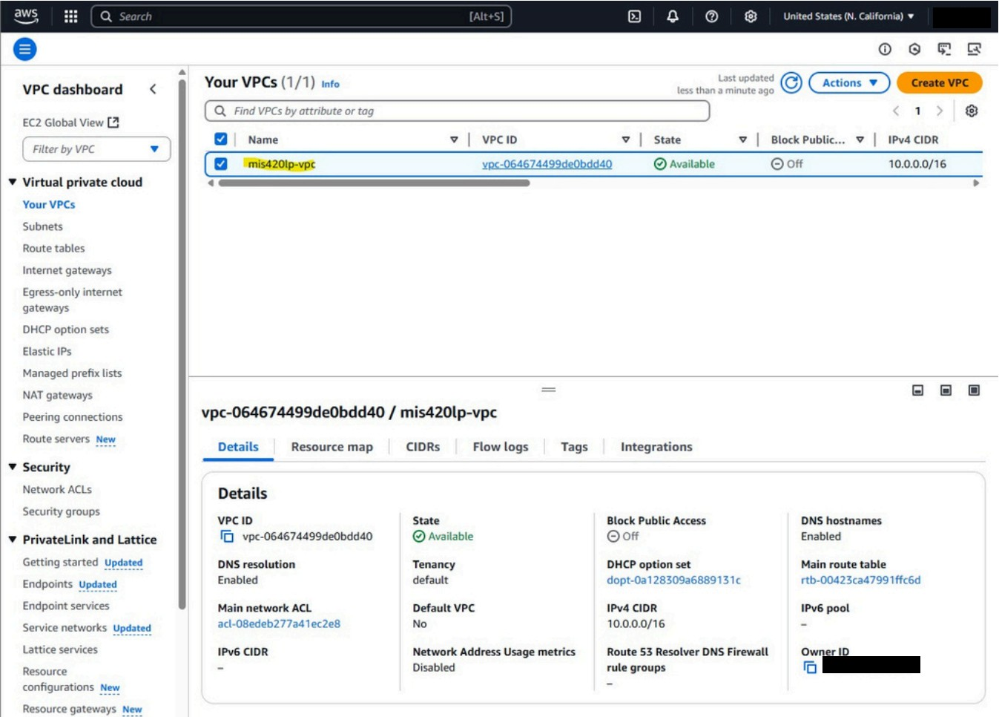
This section outlines the initial project setup for utilizing resources and determining what is necessary to successfully host a Virtual Private Network (VPN) within the AWS cloud to facilitate secure and encrypted connectivity over the internet. These first following steps involved creating a Virtual Private Cloud (VPC) and within it an EC2 instance labeled “mis420lp-openvpn”. This EC2 instance was then set to host the VPN via OpenVPN software installation and configuration on a Linux/Unix operating system. The project began by creating a Virtual Private Cloud (VPC) to segment other AWS resources, allowing for an enhanced security posture. The VPC labeled “mis420lp-vpc” was configured to have a public and private subnet for connectivity. This would allow for specific resources within the VPC to be removed and contained as part of an incident response. 
 
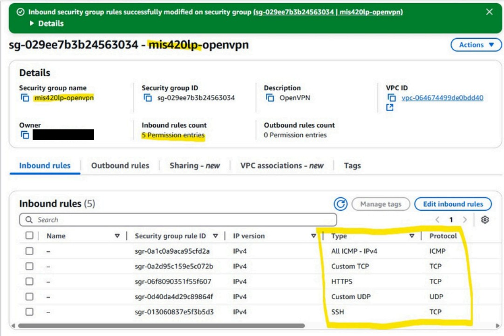
 
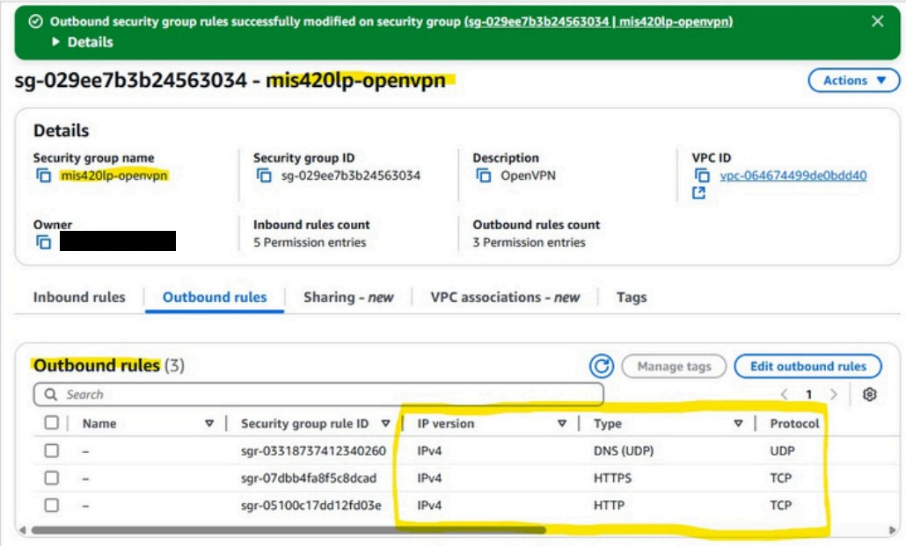
Once the VPC was established, security groups were then created, acting as a virtual stateless firewall, which examines traffic based on predefined rules. These rules were configured to open and close ports for both inbound and outbound traffic. The security group was named “mis420lp-openvpn” which has inbound rules opening ports 22, 443, 943, 1143, and all ICMP traffic. This allows for the user to connect and establish configurations via SSH terminal as well. Outbound rules are defined to open ports 53, 443, and 80. This allows for HTTP/HTTPS connections and connection to DNS. If this is not explicitly configured for outbound traffic, the user would be able to connect to the VPN but would not be able to make any connections through it.
 
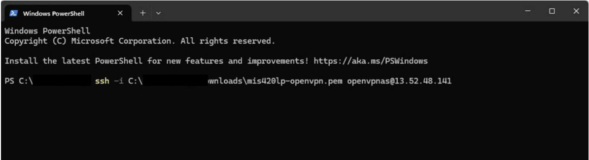
 
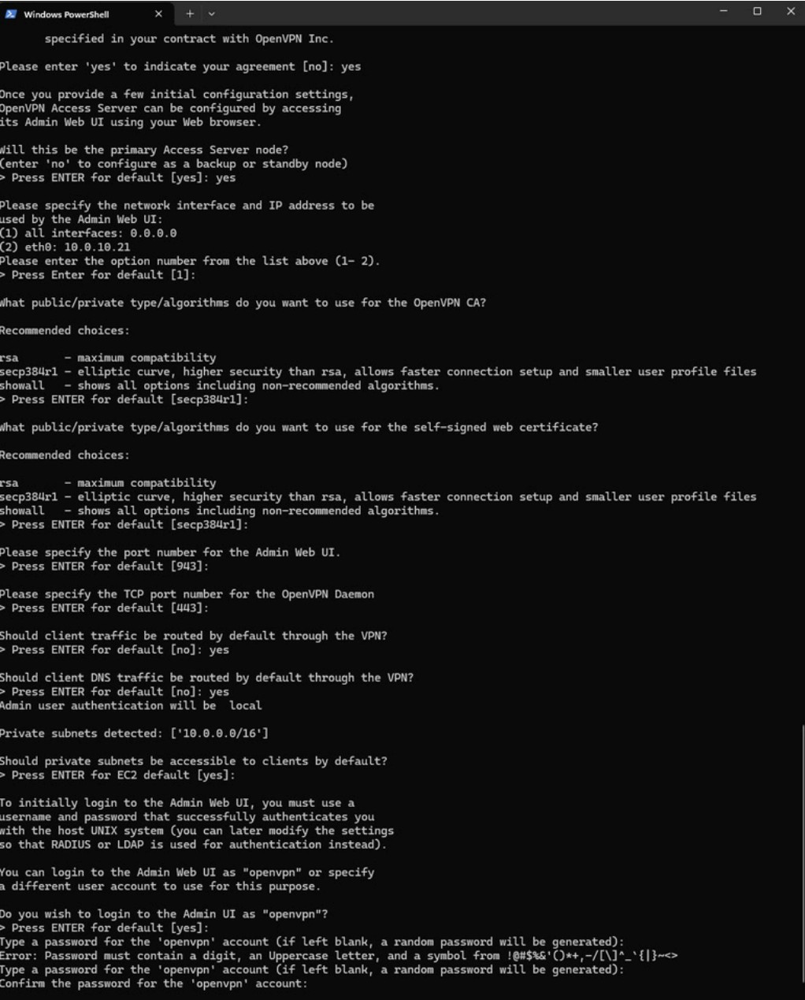
The EC2 instance was then configured using an AMI to have the OpenVPN software installed on a Linux-based OS. The EC2 was then placed on the “mis420lp-vpc" and given the “mis420lp-openvpn” security group. Initial configurations for ports and login credentials were entered by connecting to the instance via Windows PowerShell. 
 
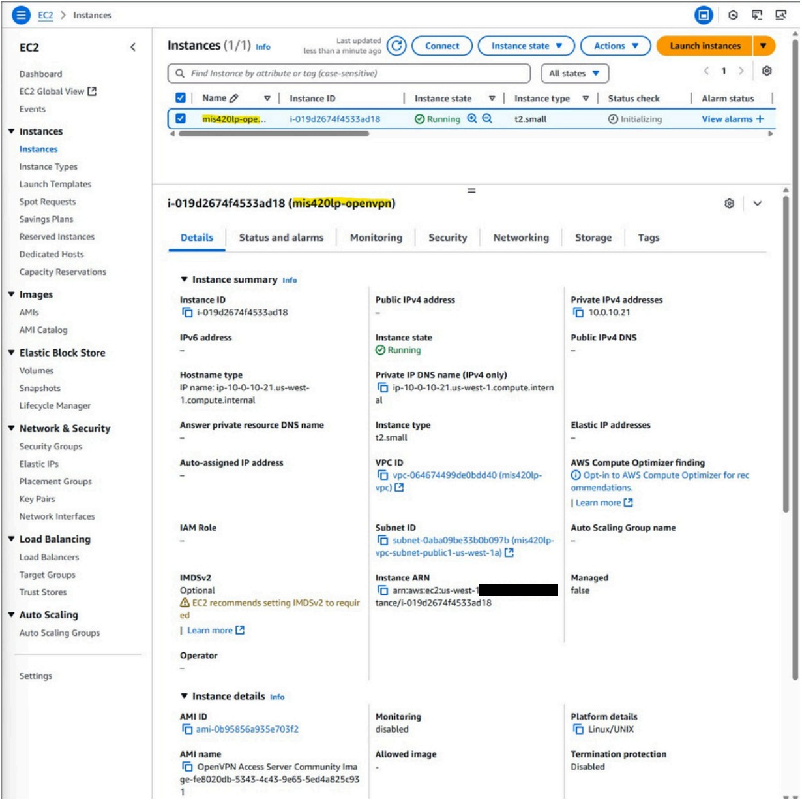
An elastic IP was associated with the instance allowing it to have a static IP. This allows the user to successfully connect to the EC2 instance and will have all traffic routed through with that particular IP address. 
 
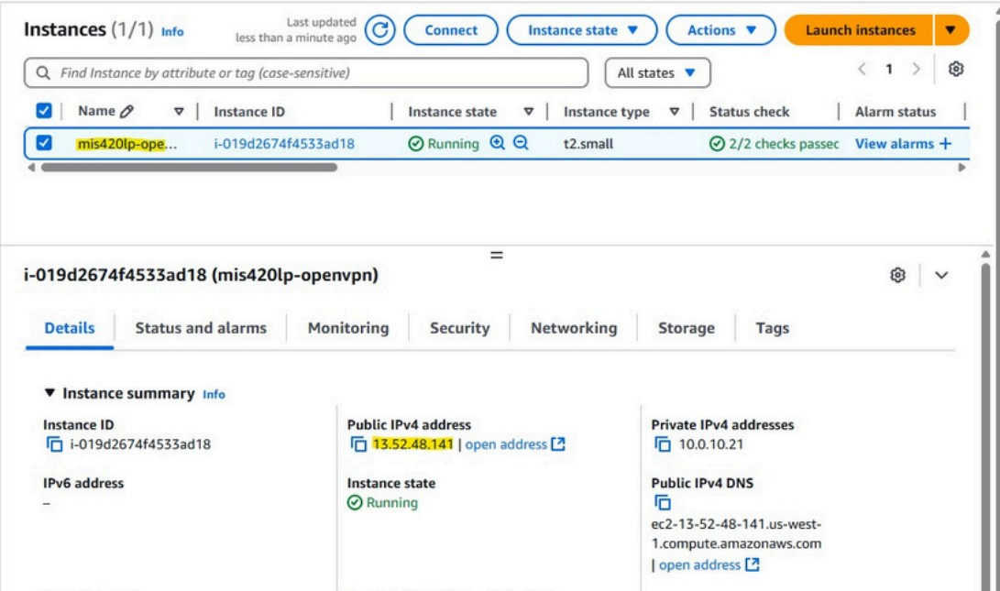
The following images show the connection with OpenVPN by using https://whatismyipaddress.com/ to show IP masking/spoofing. 
 
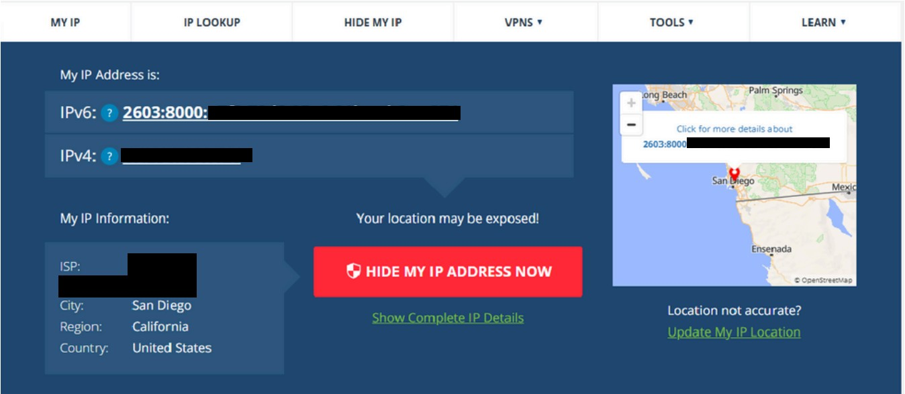
 
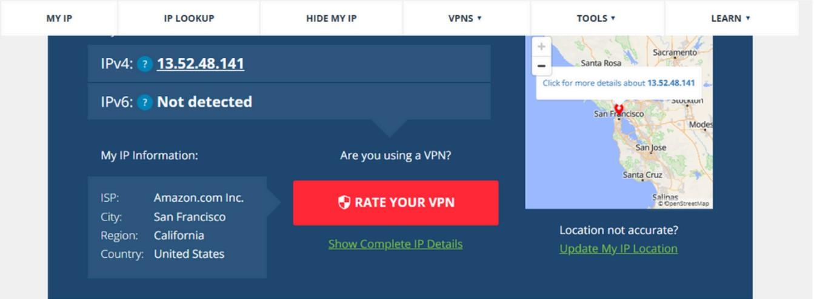
To further bolster the availability of the EC2 instance, both an S3 bucket and a backup plan were configured to have an AMI that could be used to restore or duplicate the VPN. Utilizing the AWS Backups console, a backup plan was created to increase the redundancy of the EC2 and was scheduled for monthly backups. The S3 bucket served as another form of redundancy by providing a place to store AMI backups as well. This was done by manually creating an AMI snapshot of the EC2 instance, then utilizing AWS CloudShell to securely store it on the S3 bucket. This is important in case of a possible system failure or misconfiguration of the EC2. Maintaining a constant uptime is important for reliability and stability, ensuring that essential processes are not disrupted.
 
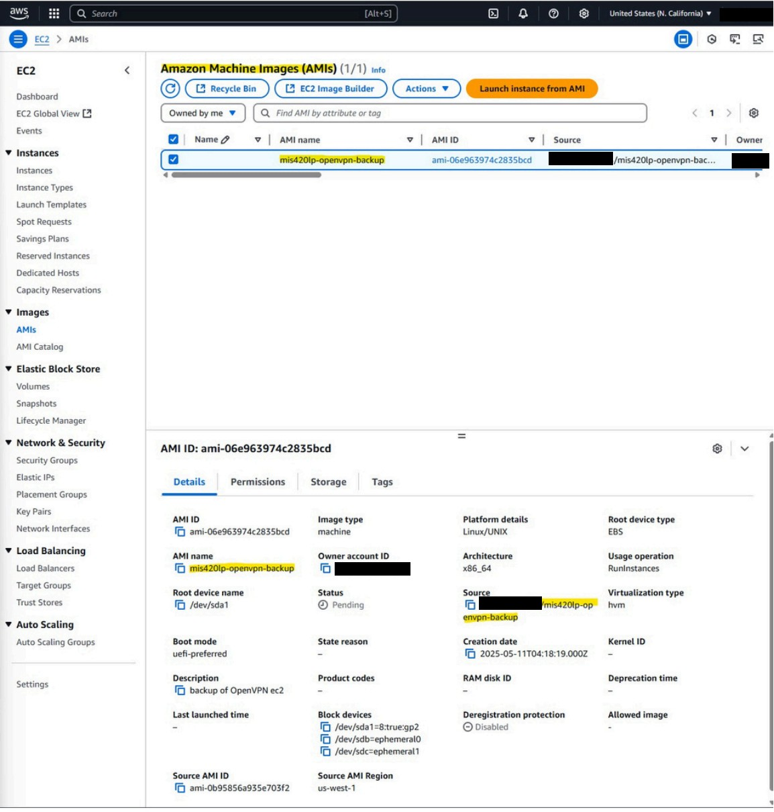
 
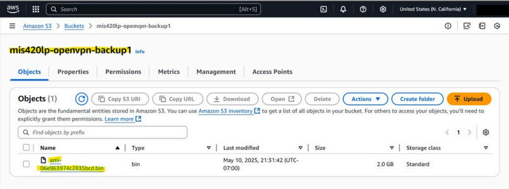
 
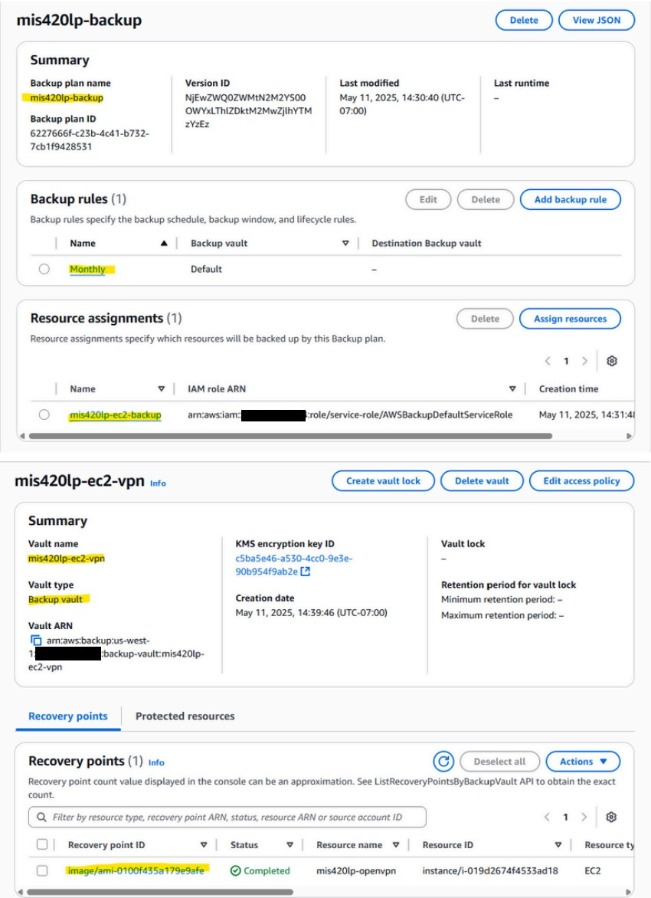
Through the AWS CloudWatch console, two different CloudWatch alarms were set to monitor the resources on the EC2 instance and alert for any suspicious activity. The first named “mis420lp-openvpn-usage” detects ingress traffic with a lower threshold to monitor anyone who initially connects to the VPN. The second alarm is named “mis420lp-networkout-usage,” which becomes triggered once network out exceeds a 100,000-byte threshold to monitor unusually high outbound traffic. Once these alarms are triggered, AWS Simple Notification Service is enabled so that an email subscribed to the notifications receives an alert. 
 
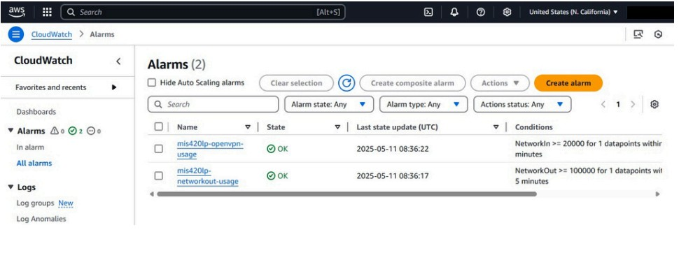
 
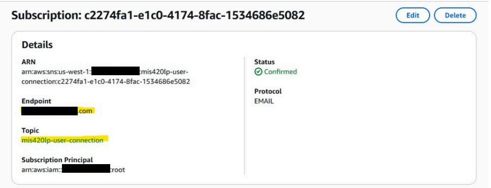
 
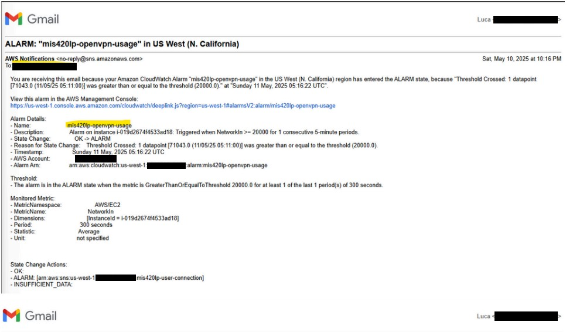
The logs generated by CloudWatch are then backed up to an S3 bucket named “mis420lp-cloudwatch-logs” for future reference. This would be useful for system auditing purposes as well as aggregation to an external SIEM tool to further analyze usage trends. These trends could then identify potentially suspicious activity on the VPC. 
 
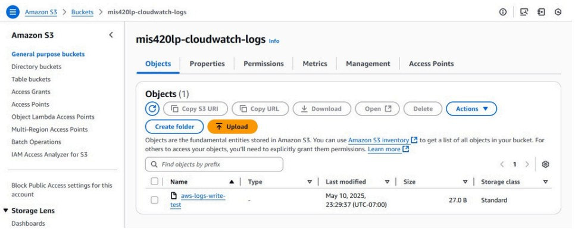
Lastly, roles and users were created through AWS IAM  for the maintenance of the EC2 instance as well as for security auditing purposes. The user “mis420lp-ec2-user” is given permissions for EC2 access, allowing for maintenance, monitoring, and configurations. The second user “mis420lp-backup-user” was created for restoration purposes across all of the VPNs' related resources, including the EC2, S3s, and AWS Backup, to act as an administrator account. The two roles that were created are named “mis420lp-openvpn-buckets-role” with the necessary permissions to manage the  AMIs and buckets associated with it, and “AWSServiceRoleForAmazonInspector2Agentless” which allows AWS Inspector to call services on behalf of the account owner.
 
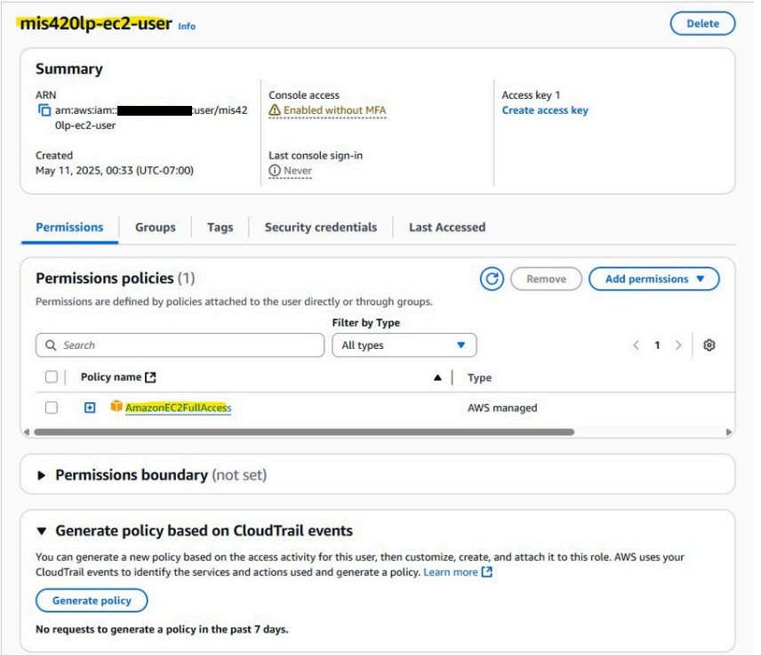
 
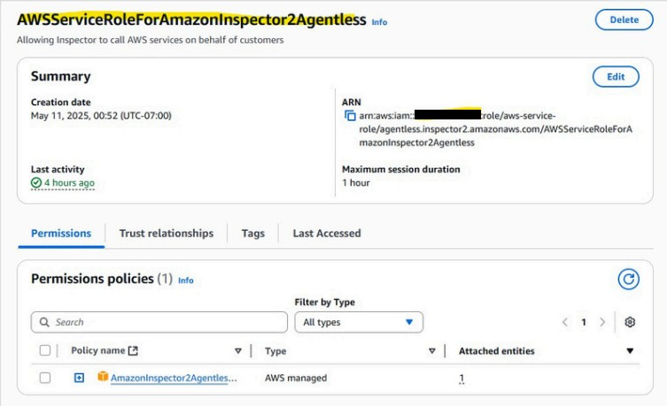
AWS Inspector needs elevated permissions as a service to conduct system auditing similar to System Technical Implementation Guides (STIGs). Vulnerabilities within all resources are evaluated and given a hierarchical rating of importance. Critical vulnerabilities are most important and should be addressed first, while high and below are carefully evaluated for importance and action. This scan would also allow administrative users to evaluate any deviations or changes to the configuration from the system baseline. 
 
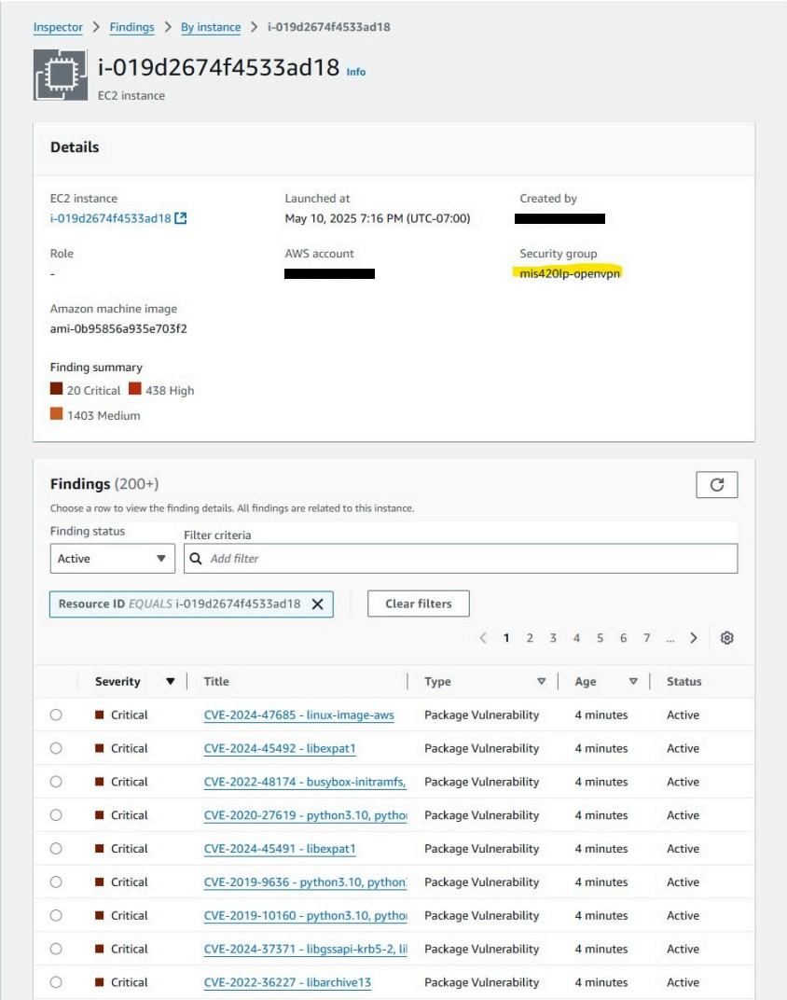

